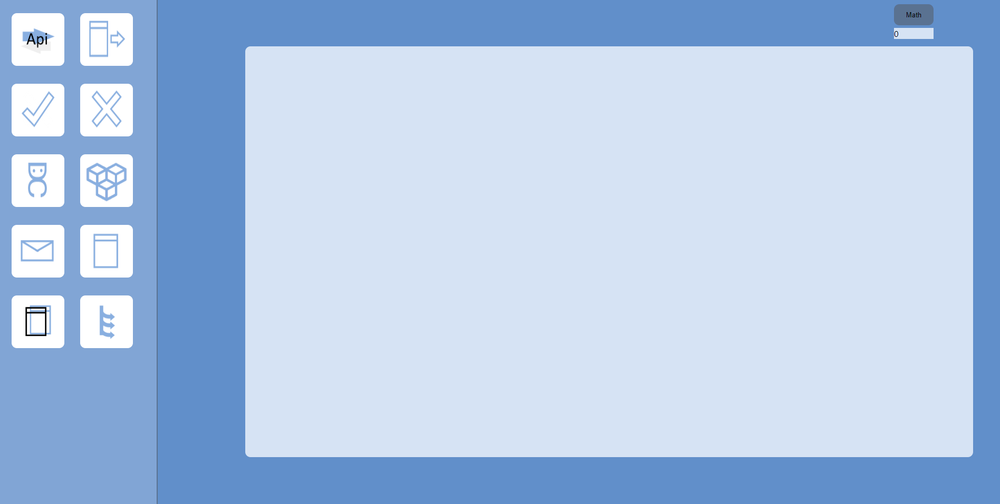
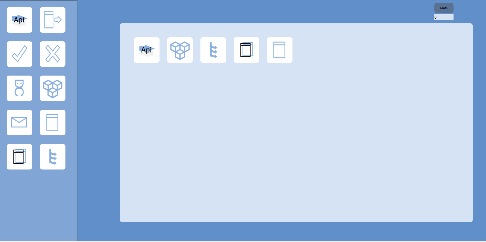
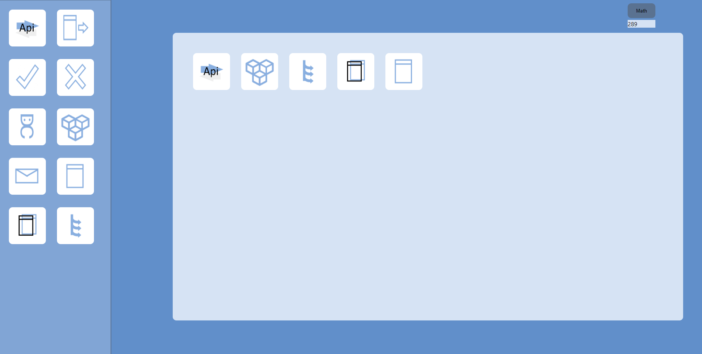
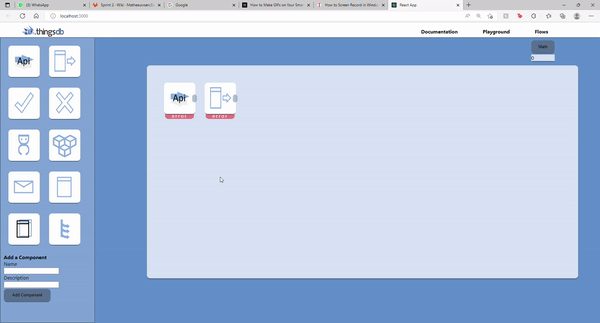
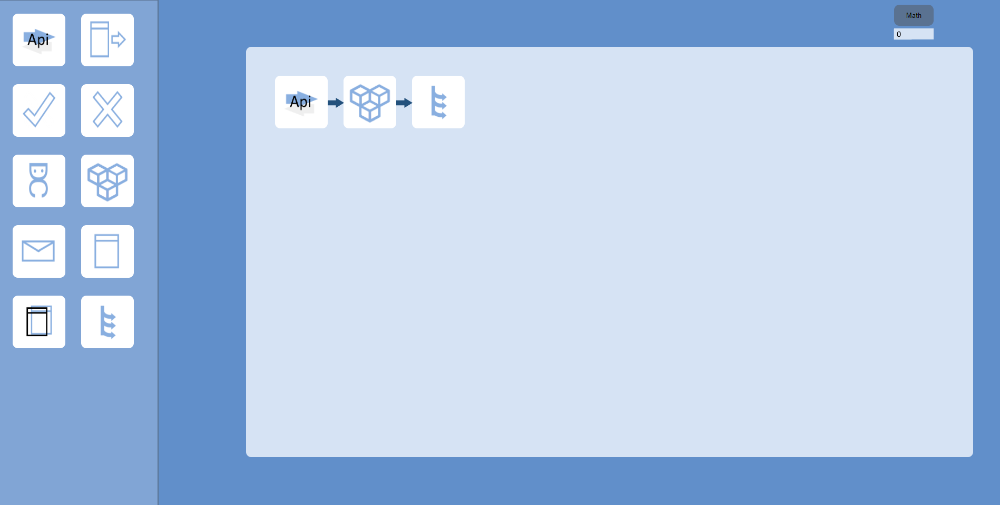

## Other way of working
For this sprint I had the idea that I wouldn't be making a lot of research documents, I wanted to spend most of my time doing research by making a prototype and researching how I wanted to make this work. Most of my time went into designing this flow tool so I didn't have a lot of time for documenting other research. I did make time to do one research this sprint as we stumbled across this question while making the prototype, you can find this research document on this page and I will shine a light on this subject on this page.

## Baby steps of the Flow Tool
This sprint I gave myself time to make a prototype, I used WebStorm to make a React front-end. In which I started designing my flow tool based on the Figma designs that I've made, this was very useful as I already knew where things were supposed to be so this made me work a lot more goal oriented. When I was done with my design I first asked feedback from my stakeholder. They were very pleased with how everything looked. But they were kind of debating if they wanted to have the sidebar underneath the board, as you would probably need a lot of room for the flow. But as I did some research on UX design I could say that this wasn't really the best way of a flow tool to look and they agreed to go further with the sidebar as it is. 

Then I wanted to add the functionality that you could drag the components inside the board, and that it would make a new list and it would showcase on the board. After some trial and error with various drag and drop libraries I had managed to make a drag and drop functionality. 

Now that I had this functionality I wanted to see if I could make this connect with the back-end in any kind of way. My first idea was to give each component a number and to make a sort of calculation between the components with a procedure in the backend. I made this work as well as you can see down below. This proved that I could make the backend and the front-end connect and that a flow tool would be possible as well. So I went back to the research document; ["Is it possible to make a flow tool on top of ThingsDB"](https://git.fhict.nl/I465040/cesbitportfolio/-/wikis/sprint-1#is-it-possible) that I made in the second sprint and I added these experiences to the document so that I could further clarify why a flow tool would be possible. I also explained how the calculations work so if you want to know more about that you can read the document as well.
 

I also wanted the option of moving the components in the board, I thought that the components shouldn't  be static and that you should be able to move them around. I used a few libraries for this and I did a lot of research by means of youtube video's and google searches. Eventually I came across a library called beautifuldnd which gave the opportunity to easily swap the components with eachother and make it look very smooth. At first it led to a few problems and errors but eventually I was able to make it possible. Down below you can see how the functionality works.   (**Disclaimer!!:** The page down below has been updated and looks better than it did in this current sprint, this is because I added this GIF later on.)

After this functionality I really wanted to put arrows between two components when clicking on them both, this wasn't as easy to do as I thought so this took me quite some time. After using a library called LeaderLine that didn't work the way I wanted to I came across a library called xarrows. This gave me the functionality that I wanted and now I could connect the two blocks together.

You can find all the code that I've made for this project right [here](https://github.com/cesbit/dragndrop)

## Returning arrows
After showcasing this to my stakeholders I got in a argument about returning arrows, are these needed? will these cause for problems? These questions were pretty important and I thought that these should be answered before I'd continue working on the prototype. So I set up a document to research if [returning arrows are necessary](uploads/a51dd840f835d02534857f47c30c04d0/Should_components_be_able_to_receive_a_returning_arrow.pdf) in the application that I will be making. This document is set up with my own research on what kind of functionalities could be needed, if these can be replaced with other ways, if it is user friendly and a multiple user tests to see what users think of this. The user tests really helped me and I thought they were very useful for the research, as they will be the people using it. I got some good feedback from it and it really sealed the research.

## retrospective
When we finished this sprint I was again quite happy with the progress that I've made, we sat together and I showed what I had made. The stakeholders were very happy with the results and thought that I had come a long way with my prototype already with the time that I had.
I think the planning that I've made so far have been very good, and that's why I could finish the things that I had in mind for the last few sprints. I expected things to go wrong with needed feed forward, and I kept this in mind with my time and scheduling but this hasn't happened yet. My stakeholders and tutor have been very positive and the feedback has been very good until now and this gives me good energy to work stress free and keep on going the way that I'm going. I don't feel bad when asking a lot of/stupid questions to my stakeholders and I quick fire questions towards them when needed. 
