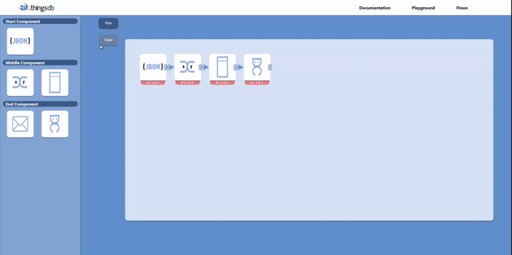
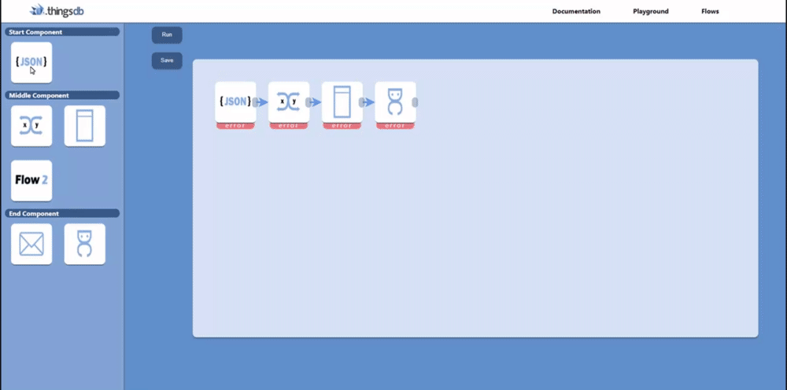
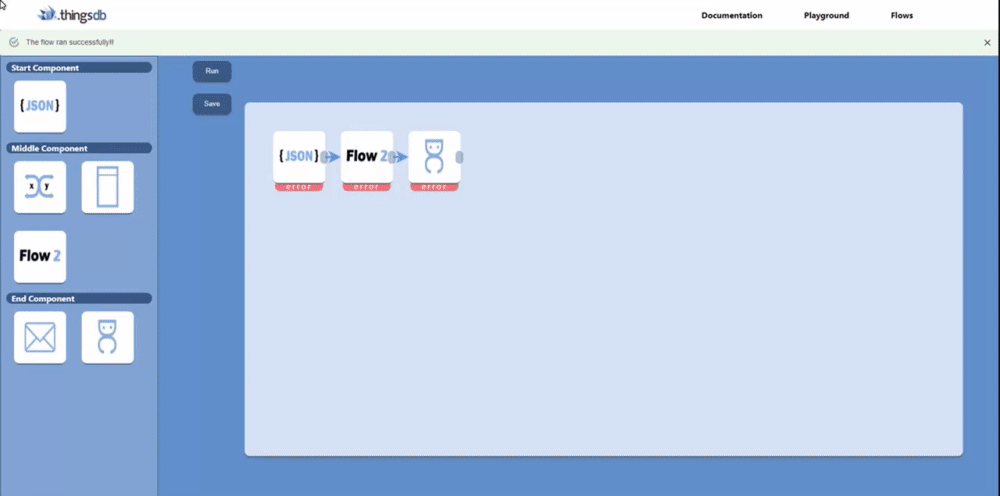

## Adding actual functionalities 
When I had figured out the multiplying application I thought it was time to make some components that could talk to eachother that actually could be used for the actual ThingsFlow application. So I started tinkering what could be a convenient route to make for this sprint that was achievable but still very cool to make. After some sketching and conversations with my stakeholders I came up with a 3 step flow that converts a JSON file to a [DutyCalls](uploads/7188a61e3307e8a5105d172f7000c0eb/DutyCalls.pdf) mail. We decided to to this step as this is one of the most default functionalities that should be in there and the stakeholders thought it would be very cool if it could make a link with DutyCalls as this is one of their projects as well. I made a video on the functionality to showcase it better, you can find the video by clicking on the link below; https://youtu.be/gw4G_18yKQ8

## Back to designing
When I was done creating this functionality I sat down with my stakeholder Jeroen, we had a chat on what would be wise to continue on now. I told him I had some few more components in mind that I could make but he came with a very good view that this wouldn´t be necessary, as he believes that these components could work but he wanted to see more functionalities, in particular a flow that could be reusable. I agreed with the idea that there should be other functionalities instead of more components and I also liked the idea of the reusable flows so this was the first thing on the agenda. I sat back and decided that I needed a design for a reusable flow, designs for how you could save it and how the component itself could look. So I made a [research document](uploads/ef1f128ee3a119d223bbefa5ffdfc6ae/Save_and_reuse_a_flow.docx) answering these questions. This docment really gave me a good preparation before I started prototyping the actual reusable flow, so it was a very good idea to write this document first.

## Reusable flows
When the designing process was done I started with the prototype, before I started making this prototype i started sketching how it should work so I'd get a better view on how it should work functional wise. Pretty fast I got the hang of it and I didn't need to sketch any further as I got the confidence I could make it as a prototype; 

-------

-------

Then I started working on saving a flow, I had to think about what should be saved inside the flow so the correct information could be used in the backend. All of the information that had been filled in should be saved when making a component so you don't have to do that tidy work so this was kind of a challenge. But as you can see I made the function so you can save a flow as a component; 

-------

-------

After that I started making the functionality so that it actually works, first I thought there wouldn't be any problems because it'll just go through the component with the given functionalities but it didn't work like that, so I had to write a different function for this component that goes through all the functionalities that it contains. With some hard work and trial and error I'd managed to fix it and make it work as follows;

-------

-------