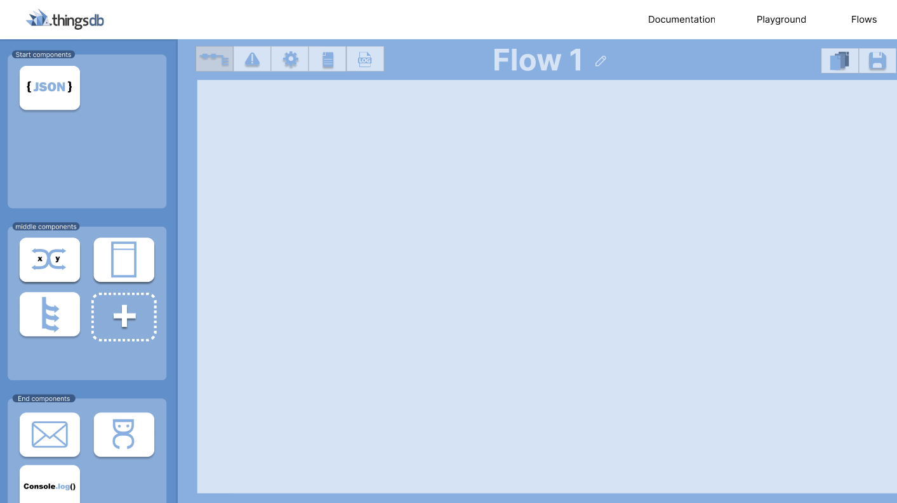
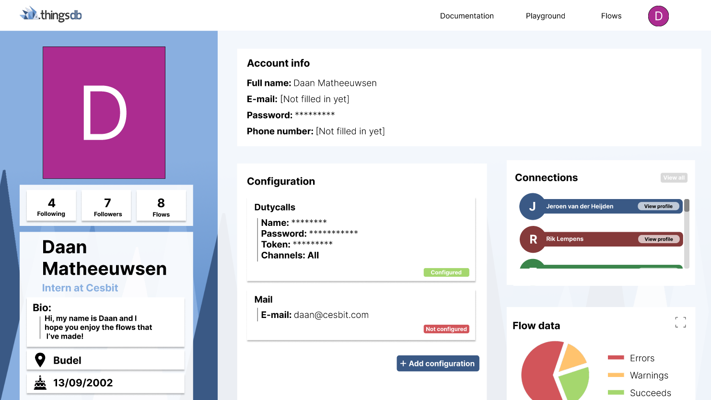
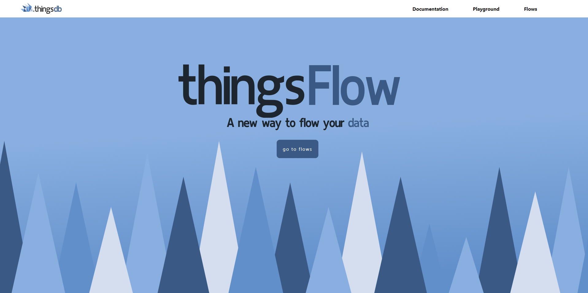
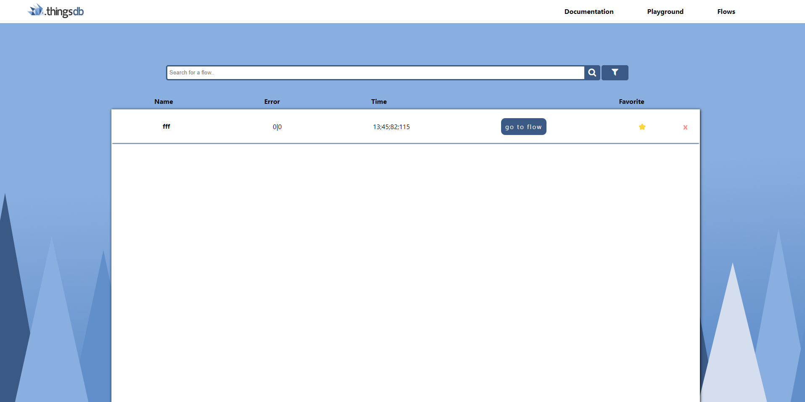
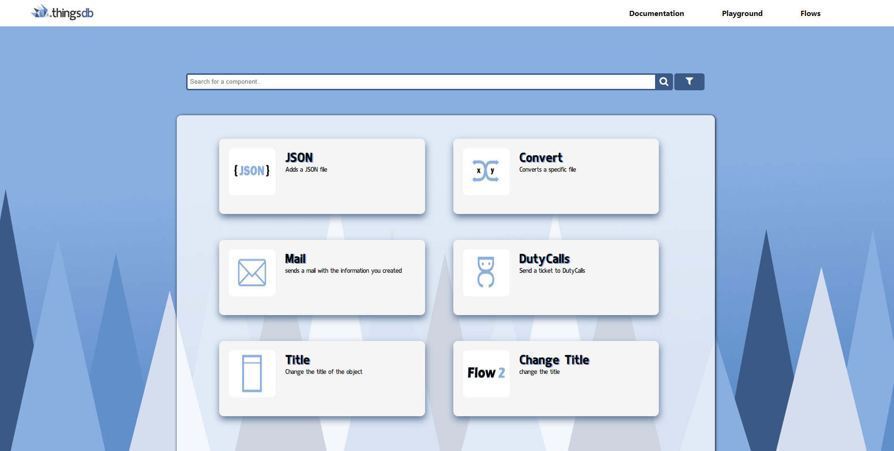

## Before the sprint
When setting up this sprint we sat together again as we do every sprint, we reviewed the last sprint and now we needed to find out what we wanted to do for the upcoming sprint. The three of us had the idea that I had come pretty far with the functionalities in the prototype but there were still a few functionalities that they wanted to know how it would look. I offered the idea to start designing a complete functional design in Figma, as they found it more important how it would look rather than how it would function I thought this was a good idea. They agreed with this and gave me a few functionalities that they would really like to see in this design and this gave me a few directives which I could hold on to while making the design in Figma. I chose to make the design in Figma as I had made designs for this project earlier on in Figma and I was pretty comfortable with this already, and it is just a very easy platform to make designs and make them 'talk' with eachother.

## Start of a new design
When I began I wanted to make the design that I had a bit more new, As I found that the old design was a bit old and boring I wanted to give it a more sleek design, a few things that I wanted to change was the sidebar, the header and the components itself.
I wanted to change the sidebar as it looked a bit random and it wasn't as slick as I wanted.
I also wanted to change the header as it took much space which wasn't needed, it created a lot of white space.
And lastly I wanted to change the design of the components as I had made a few components in my prototype already these could be used already but I also wanted to change the error handling.
With all these in mind I created my first design of this sprint which looked as the following; 

-------------------------------------

## Functionalities the stakeholders wanted to see
As mentioned earlier there were a few functionalities that the stakeholders wanted to see in the design, as they didn't know if it was still possible in the time that I had in this internship. The things that they found important was; 
* How you would see, use and configure the error handling
* How the errors would be handled inside the flow, and with what kind of ways
* How configuration with other applications, such as DutyCalls or Mail, would look like
* How the switch cases would work
* Maybe some own input

You can find the whole design and the things that I made here: [figma design](https://www.figma.com/proto/RIRckga4ygXjIpYMYyj278/ThingsFlow?node-id=425%3A3202&scaling=scale-down&page-id=0%3A1&starting-point-node-id=425%3A3202&show-proto-sidebar=1)

For my own input I came up with a idea when I was making the profile page, as I was getting some inspiration from other profile pages I saw a lot of pages with friends. Then I came up with the idea that Thingsflow could have 'friends' with whom you can share your flows with or maybe even work together on a flow in that way. When asking feedback on this idea they really thoroughly liked this idea, but Jeroen still didn't really know how they would implement this idea yet so they wanted to keep it in mind for later updates. When I showed my design to Erik he told me that the naming 'friends' wasn't really a good way of putting it as this will mostly be used inside companies and then it wouldn't make sense calling it a friend and more something like "link" or "connection" as it is more formal. 

-------------------------------------

## Additions to the prototype
When I was done designing I showcased it to my stakeholders at the company, they were really happy with the outcome and they were very happy that I made everything so detailed. This way when the final prototype wouldn't be finished at the end of the internship they would have a very fine idea on how things should work. They found it very cool that I am so creative and they were very surprised with how I made some specific choices. Now that I still had some time we had a chat with what I should do now, I had the idea in mind that I could make a few more pages on the prototype such as the pages that are shown in the header and a home page, they thought this was a good idea and thought that I could finish this with the time still given in the sprint. 
As these designs were already pre-made in Figma I had a good structured idea on what to make and this really helped me as it gave me a good guideline on what to make.
So I started designing the home page first, I wanted to make something abstract but that still had something to do with ThingsFlow. So I came up with the idea to make spikes, as if the application is made on the back of the hedgehog that is the logo of ThingsDB and ThingsFlow;

-------------------------------------

 

-------------------------------------

Then I made the Flows page, I followed the design of Figma so it looks pretty alike. I did decide to not make the background see-through as this was pretty distracting and this could lead the eyes away from the functionality that it is meant for; 

-------------------------------------

-------------------------------------

I also made the documentation page, here you can see all the components that can be used with the given information. As I didn't make this in Figma yet I didn't really have an idea on how I should make this but this wasn't really that big of a problem. First I made the components a bit bigger as seen below;  

-------------------------------------

  

-------------------------------------

I didnt really liked how it looked so I decided to do some user tests to see what people found of this. I gave them the two options given up above with the additional questions which one they liked and what they would change. I got some good feedback that there was a lot of white space and that I should make them smaller. After all the user tests that I did I came up with this design; 

-------------------------------------

## Retrospective
When we finished this sprint we sat down and showcased what I had made, I got some very positive feedback on the Figma design and they thought it was very good that  I came up with the idea to work further on the design in the prototype on my own. They did give me the feedback that I missed a few frames in my design and that I should take some time to add these as well so that they´d have a clear idea on how this would work as well. For the upcoming sprint they wanted me finish a few design issues in Figma and they also wanted me to work on the functionalities again, we had concluded together that it would be a good idea to start making a few functionalities in the prototype. I had mentioned that I would like to make the functionality to save flows and view them and they agreed that this would be a good functionality to make and that it would fill in a whole sprint. 
 The feedback that I had received from Erik was that I should work more methodically, so I should work more goal oriented with my researches. This means that I should ask questions with a certain goal where they should be aiming towards. And that I should also ask why users make certain choices when testing. This was very good feedback a I let people just play around with the figma design and I got some good feedback from it but I feel if I did it the way Erik explained to me I could´ve gotten even more out of it.