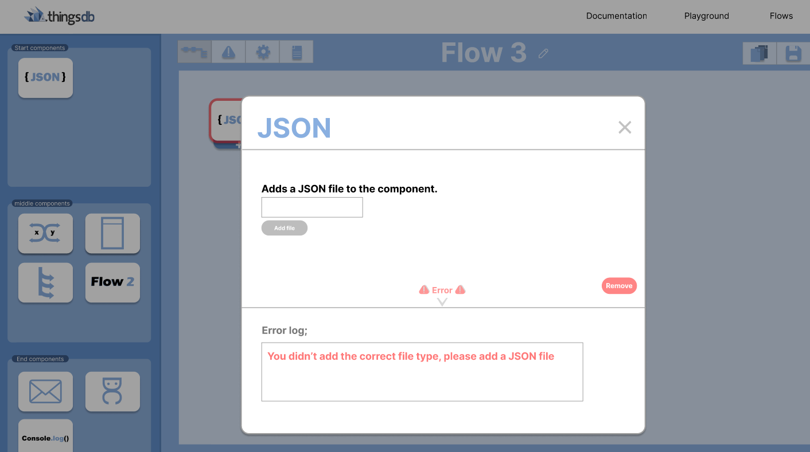
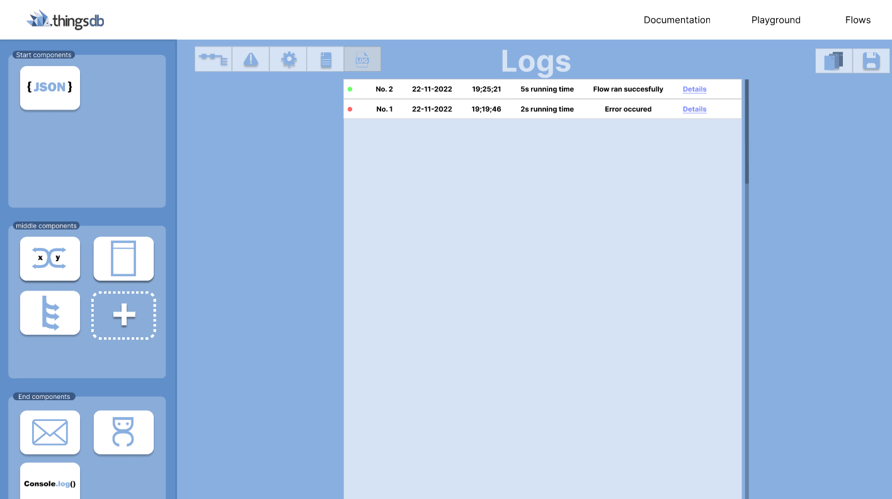
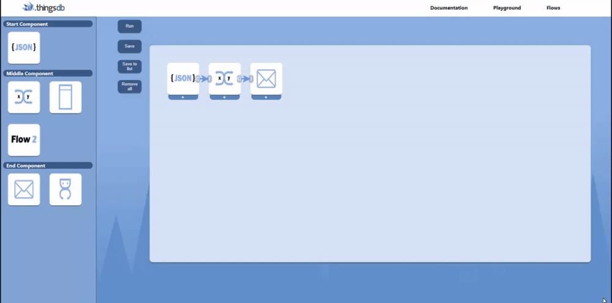
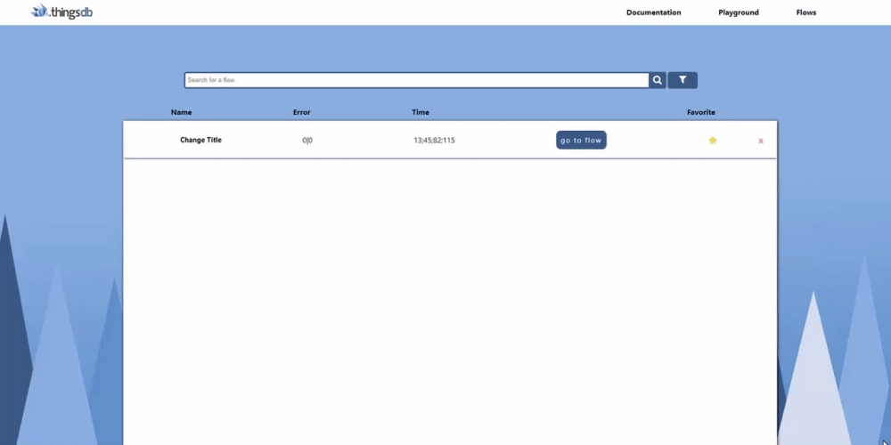
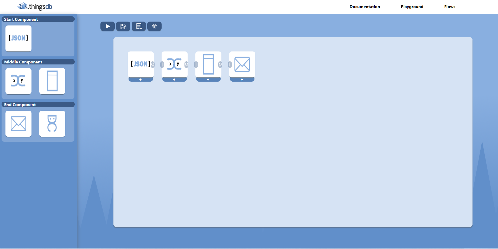
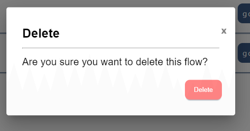

## Before the sprint
When starting this sprint there were a few things that had to be done before I could go back to making more functionalities in my prototype. My stakeholders missed a few things in the figma design from which they really wanted to see the functionality. So I put these all in a list and put this on the number one priority to do, as this wasn't as much of work I took in mind that this would only take about one to two days. We also concluded last retrospective that I was gonna make a functionality to save the lists on the playground page and view the lists on the list page.  We set on this functionality for this sprint as I had made the error handling in the design and the switch case as well, and these two functionalities were pretty hard to do in just one sprint so we settled on this one. This was a pretty big task to do and we thought that this would take the whole sprint after finishing the design. 

## Finishing and improving the designs in Figma
There were two big things that the stakeholders were missing, the first thing that they missed was how the switch case would work. Beforehand you would just click on the switch case and after that on a end-component and it would just appear but it wasn't clear for the stakeholders how this would work. So I improved this by making a modal inside the switch case component where you can manually choose how many cases you want and what kind of statement there should be in there. You can test the switch case right here; [Switch case](https://www.figma.com/proto/RIRckga4ygXjIpYMYyj278/ThingsFlow?node-id=438%3A3569&scaling=scale-down&page-id=0%3A1&starting-point-node-id=425%3A3202&show-proto-sidebar=1)

---------------------

---------------------

Another thing that they were missing were the error logs, at first I had made a error by bordering the specific component in which an error occured. But they wanted to see how it would look inside and they also wanted to see a specific page were the logging was made. So I made a modal when clicking on the component that went wrong and when you click on the error notification you get to see what went wrong in as an error log, you can try it out here; [Error logging](https://www.figma.com/proto/RIRckga4ygXjIpYMYyj278/ThingsFlow?node-id=463%3A3541&scaling=scale-down&page-id=0%3A1&starting-point-node-id=425%3A3202&show-proto-sidebar=1). 

---------------------

---------------------

I also made a new icon you can press to see the logging of the flow, when pressing on it you get to see the page where the logging of the flow is shown. Here you can see information about the flow when it has ran such as time that it took, when it ran, and some specific details. I decided on making a separate page for the logging as I had done some research on other logging pages and tinkered about a good design for this and ended up coming to the conlusion that a separate page is mostly used and in my eyes also the most uncluttered. You can try it out here; [Logging](https://www.figma.com/proto/RIRckga4ygXjIpYMYyj278/ThingsFlow?node-id=610%3A3079&scaling=scale-down&page-id=0%3A1&starting-point-node-id=425%3A3202&show-proto-sidebar=1)

---------------------

## Making the functionalities in my prototype
The first thing that I wanted to make was the the option to save flows as a list, this was the most logic thing to start with in my eyes. So I started making the code in the backend that saves the functionality and the specific information that you have given inside of the component so that that you don't have to fill this in again. So when pressing the button 'save to list' it went to the back-end with a specific name you gave to it.

----------------------

---------------------- 

But now it still had to go somewhere, it should show on the list page. So from the backend it should retrieve the name and also the components that are inside it, because you also need to be able to view the flow. 

---------------------- 

---------------------- 

I also made the functionalities that you can remove the component inside the flow, as I had been refreshing to remove them every time I thought it was time to finally make a button for this. I also made it possible to remove saved flows out of the list, I chose to make a modal when pressing on the cross first as I found it important that you don't press on remove by accident and this causing everything to be gone.

---------------------- 

## Minor design changes
After I finished these functionalities I wanted to make some changes in my design, as I still missed a few things that I had designed in my Figma design in my prototype I wanted to add these first. The first thing that came to mind were the buttons, as my stakeholder mentioned why I made completely different buttons in my prototype earlier in a retrospective. So I began designing pictures and forming the buttons so that it looked more like the design that I had in Figma.  
As seen in the image below I also made a minor change to the sidebar, I made this change because I wanted it to be more structured, and by putting the diffirent types of components in a sort of 'box' I thought it would be more readable for users to know which component is which.

-----------------------

-----------------------

After that I wanted to upgrade the modals, I found them pretty boring and I wanted to add something to them so they weren't just plain and white. I first came up with the idea to give the title of the modal a kind of background, so it would stick out more and the modal wouldn't be as boring. But I came to the conclusion that it wasn't really possible in a modal and that it wouldn't look as nice as I had imagined. Then I came up with the idea to give the modal a background as a whole, as the logo of ThingsFlow is a hedgehog I wanted to stick with the spikes just as I had on my page background. It did need a minor design change as it had to be put on a white background so I made it grey on white in Figma and imported it in my prototype. At first I made it fully white as seen below; 

--------------------

--------------------

But I didn't like how this looked, I wanted more dimension to it. So I made the front spikes a tad darker and the design ended up looking as follows; 

-------------------

------------------