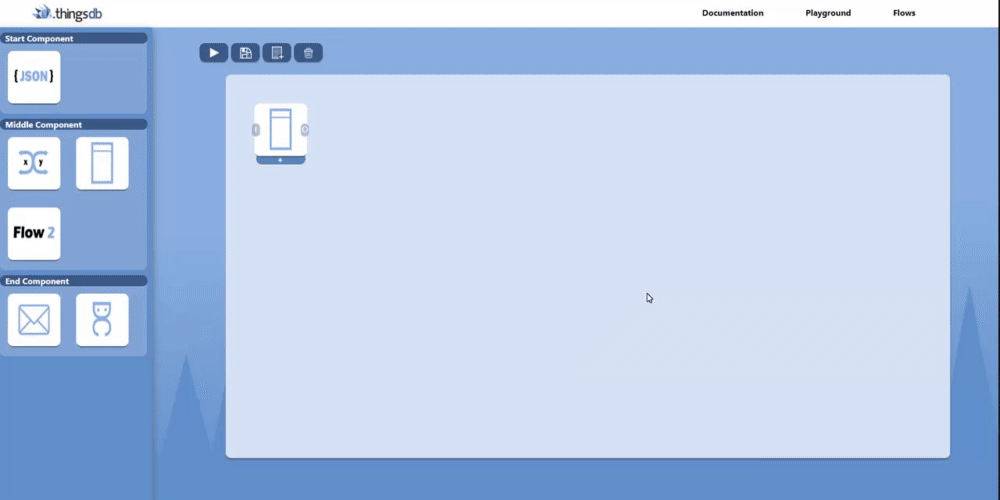
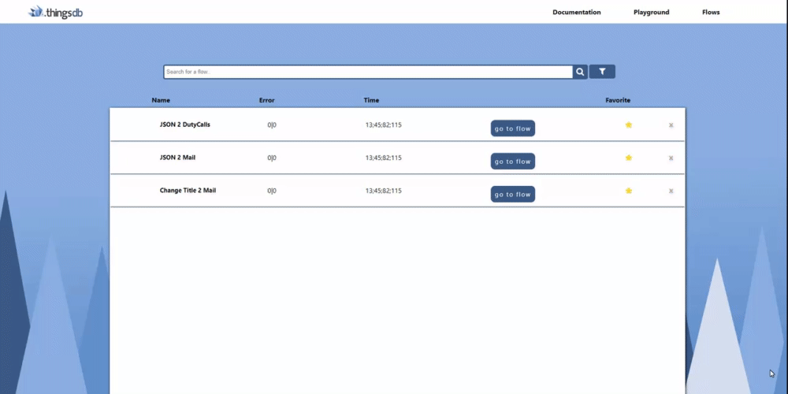
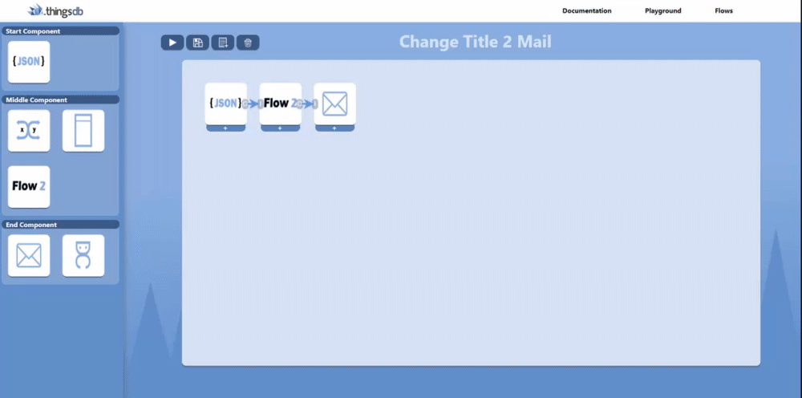
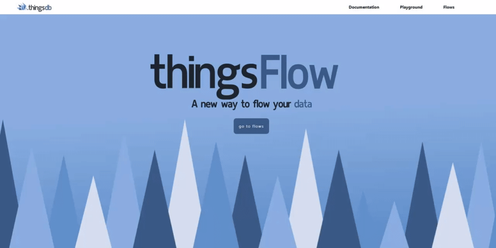

## Before the sprint
Before we started the sprint we sat down with my stakeholders to indicate what we wanted to do next, as I wanted to make another functionality not knowing we didn't have that much time left my stakeholders had stated that it would maybe be a better idea to start fixing the bugs that are currenly still in the application and after that maybe work further on the last functionallity that they had in mind. They were pretty confident that I could work on this last functionality in this sprint, as it didn't really matter to them if it would be actually in the prototype or just something like a design. As long as I would do research on it and work it out in some sort of way they would be really satisfied. But first I started fixing the bugs that were still in the application and added some finsihing touches which I will elaborate more in the following paragraphs.

## Fixing bugs
The first bug that I fixed was one where I couldn't immediately put a component inside of the board, this caused me to recompile the whole application first before I could put a component inside of the board. I fixed this by changing the way I render the sidebar, first it rendered it every milisecond which caused it to give this priority. So I changed it that it only gets the sidebar the first time, this fixed the problem and I finally didn't have to recompile the application anymore.

----------------------------

----------------------------

The next thing that I wanted fixed was the fact that the current value didn't show up immediately, you first had to go out of the modal and go back in to see it. This happened because it was put inside of a UseState, and this only updates when the whole page gets rendered as a whole again. So this meant I needed to work around this to make it show up immediately. I did this by firing up another useState that is used as a decoy, I did this as my stakeholder gave me this tip a long time ago that this could work for some occassions. 

----------------------------

----------------------------

Another big bug that was still in the application was the fact that when you view a saved flow that it doesn't show the arrows that you had connected. This was caused because I only loaded the components that were on the board and I hadn't made a function yet that would generate the arrows that you also had connected to the components. So I started writing the function that saved the arrows to the backend as well and also the function that would load the arrows that you had connected.

----------------------------

----------------------------

Then I noticed that when viewing a saved flow with a custom component that it doesn't show that component but rather the components that are inside of it. This was caused because the function that I had originally written just loaded the functions that were inside of it rather than looking if it was a custom component. so I rewrote this function and this fixed the problem as a whole, this did cause for some extra bugs but those will be explained further below.

----------------------------

----------------------------

As I had fixed the fact that you could see the custom component in saved flows another bug had occured. Now I couldn't run the application anymore with custom components inside it and it only showed an error when running. After doing some research I had noticed that it didn't work because of the fact that I changed a few objects inside of the component to make the component visible in the saved flows. So after some changing here and there I made it work again. 

-----------------------------

## Finishing touches
As I wanted to add some more to the design I noticed that the pages were a bit static, when going from one to another it didn't flow well and the homepage was still kind of boring in my eyes. So I made the decision to add animations to the webpage. The homepage needed some more spice when first starting it and when going to other pages it should have that little detail that satisfies the user. So I ended up animating the whole front page so that the background, title and button comes up from underneath in a satisfying way **(In the gif it doesn't look as smooth as it has less FPS)**

-----------------------------

## Navigating through the board

The last functionality that the stakeholders really would love to see was a way to navigate through the board when it would become too big to view on your screen. For this I made a research document designing different ways to make this functionality work and doing research on which one of these could work the best. I chose to do this research first as I wanted to know what the users would like the most on the application as it is most important to know what your users want. I had a vision in mind already which I often have but seeing other peoples perspectives was a really good way to know how it can look as well. You can read the research document [here](uploads/9c740cb65dc031492e0d400956d480f4/Navigate_Research.pdf)
Inside the research document you can try out the different designs that I made in Figma, it is linked to the specific page where you can try it out. This research really helped giving me guidance on what kind of way I want to navigate through the board, and it gave me a lot of different additional ideas from other perspectives. This really helped a lot and I'm happy with the results that I've got.
